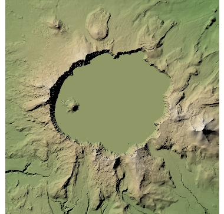
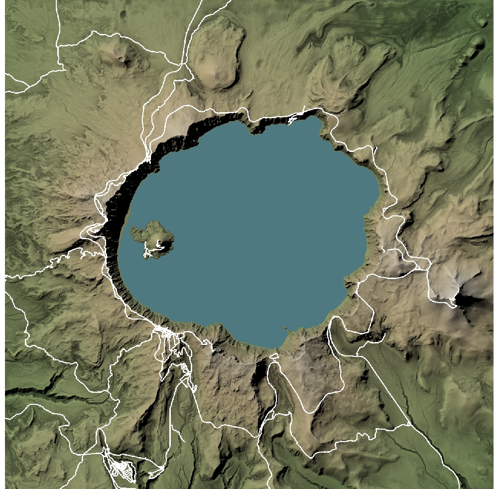
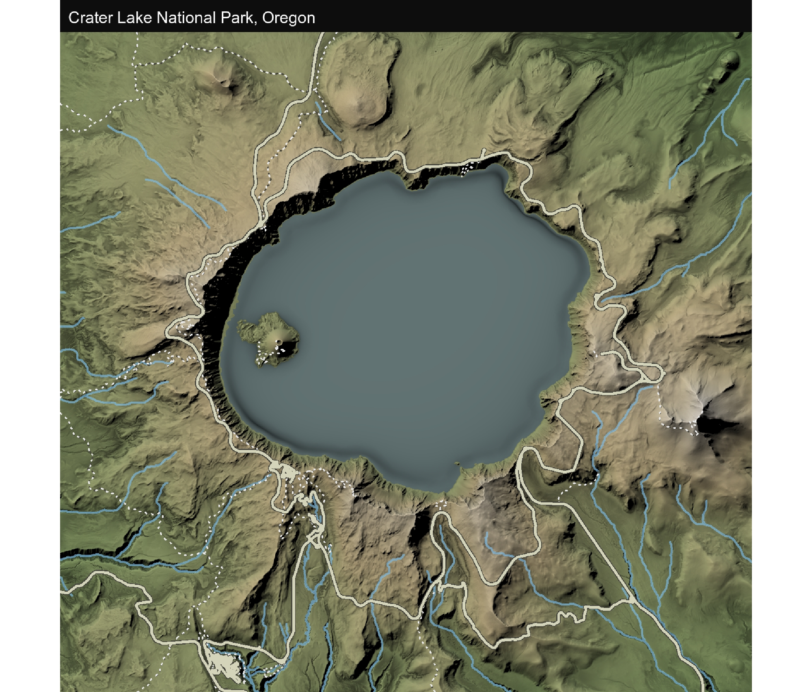
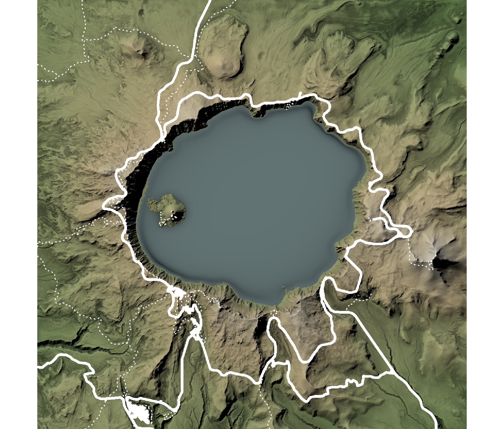
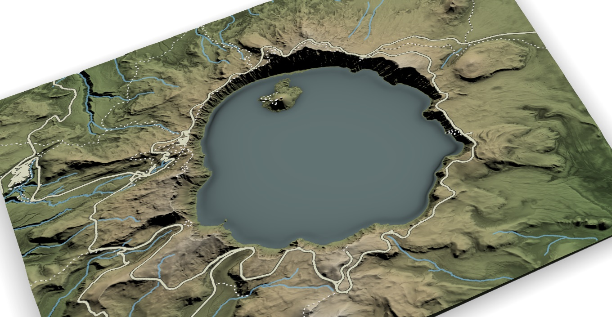

# VISUALIZE A NATIONAL PARK IN 3D IN R

Code provided in repository.
Bonus: generate 360 screenshots (frames) that can later be used to render a video

## Images
Image

Image

Image

Image

Image

Image

## Video (link)
https://youtu.be/pqtCy4Zcuk0